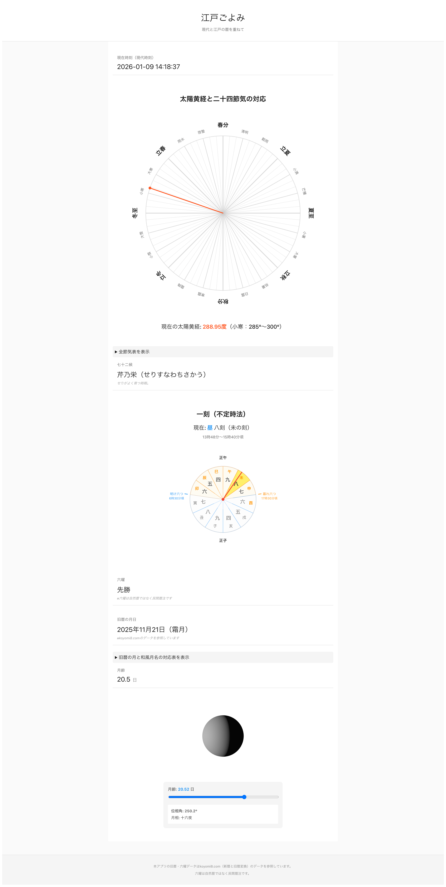

# 江戸ごよみ 〜 現代と江戸の暦を重ねて 〜 

Edo-inspired natural time system for Japan.  
Based on the lunisolar calendar, solar terms,  
and pre-modern timekeeping traditions.

This project is not limited to the Edo period.  
The Edo era is used as a well-documented reference point.

---

本アプリは、日本で使われていた

- 旧暦  
- 不定時法  
- 二十四節気・七十二候  

といった暦や時間の仕組みを、  
**現代のWeb技術で可視化**することで、

> 「自然とともにある時間感覚」

を体験できる、  
**教育・文化用途のWebアプリ**です。

---

## きっかけ

昔の日本人が、  
どのような暦を使い、  
どのように時間や季節を感じていたのか。

実はそれを、  
ほとんど知らないまま生きていることに気づいたのが、  
制作のきっかけでした。

「旧暦とは何か」  
「不定時法とは、どんな感覚だったのか」

それを**自分自身で理解したい**と思い、  
このアプリを作り始めました。

---

## 制作を通して学んだこと

- **太陽黄経**  
  季節を「角度」として捉える考え方

- **二十四節気・七十二候**  
  中国起源の暦法を、日本の自然と感性に合わせて発展させた季節の知恵

- **一刻（不定時法）**  
  昼と夜で長さが変わる時間の単位

- **明け六つ／暮れ六つ、丑三つ時**  
  現代とは異なる時間の基準

- **月齢・月相**  
  月の満ち欠けと生活の関係

---

## 難しかった点

### 旧暦の算出について
旧暦の月日算出は、  
中気や閏月の判定を含むため、実装が非常に複雑です。

初期バージョンでは、  
以下の公開情報を参考データとして参照しています。

https://koyomi8.com/kyuureki.html

### 月の満ち欠け表示について
月相の表示を2D（SVG）で数式的に表現することは難しく、  
物理的に破綻しない表現ができませんでした。

そのため、本アプリでは  
**3Dライブラリ（WebGL / three.js）** を使用しています。

月齢データについては、  
以下の公開情報を参考にしています。

https://koyomi8.com/databox.html#moonface

---

## 実行イメージ



---

## 今後追加するかもしれない機能

- 任意の日付を指定して暦を確認する機能
- 過去・未来の節気カレンダー表示
- SNS共有機能
- 表示データのエクスポート

---

## 現在位置について

本アプリでは、不定時法（日の出・日の入り）や節気の表示を、その地点の緯度・経度・タイムゾーンに合わせて計算するために、ブラウザの位置情報（Geolocation）を使用しています。位置情報の許可をいただかない場合、または取得できない場合は、東京をデフォルトの地点として計算します。

**位置情報を許可していただいても、個人を特定する情報は取得・保存していません。** 取得した位置はサーバーへ送信せず、お使いの端末内での表示計算にのみ利用します。

---

## 注意事項

本アプリは、  
生活・文化・教育用途を目的として制作しています。

可能な限り正確性には注意を払っていますが、  
旧暦や天文計算には  
簡易モデルや参照データを用いている部分もあります。

誤差や解釈の違いが含まれる可能性があることを、  
あらかじめご了承ください。

## スマホPWA

本アプリはPWAとしてインストール可能です。
スマートフォンではホーム画面からアプリのように利用できます。

### アナリティクスについて

本アプリでは、プライバシー重視のWebアナリティクスツール「[GoatCounter](https://www.goatcounter.com/)」を使用しています。  
個人を特定する情報は収集せず、ページビュー数のみを記録します。

Analytics: Google Analytics 4, GoatCounter

### 旧暦・六曜データについて

**六曜は自然暦ではなく、民間暦注です。**  
占いや運勢判断を目的としたものではありません。

---

## 技術スタック

- TypeScript
- React（関数コンポーネント）
- Vite
- PWA（vite-plugin-pwa）

---

## 開発

```bash
npm install
npm run dev
npm run build
```

## ライセンス

This project is licensed under the MIT License.

