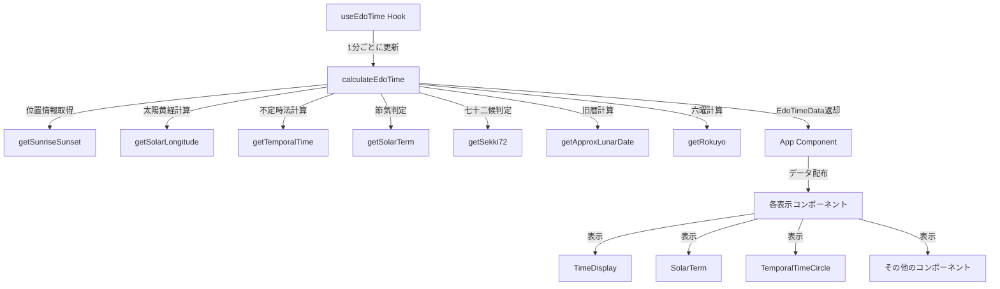

# 江戸時間アプリケーション 設計書

> **注意**: このドキュメントはソースコードの変更に合わせて都度更新してください。

## 概要

江戸時間アプリケーションは、江戸時代に使われていた不定時法・旧暦・節気・七十二候といった「自然と同期した時間感覚」を、現代の技術で可視化するWebアプリケーションです。

### 主な機能

- **不定時法の表示**: 日の出・日の入りに基づく12刻（昼6刻・夜6刻）の時間表示
- **二十四節気・七十二候**: 太陽黄経に基づく季節の区分表示
- **旧暦表示**: 簡易モデルによる旧暦の月日と月齢の表示
- **六曜表示**: 民間暦注としての六曜の表示
- **視覚化**: 円形の時計表示による不定時法の可視化

## アーキテクチャ概要

このアプリケーションは、React + TypeScript + Viteで構築されたシングルページアプリケーション（SPA）です。

### 技術スタック

- **フレームワーク**: React 18.2.0（関数コンポーネント）
- **言語**: TypeScript 5.2.2
- **ビルドツール**: Vite 5.0.8
- **スタイリング**: CSS Modules

### 設計思想

1. **責務の分離**: コアロジック（`src/core/`）とUI（`src/components/`）を明確に分離
2. **意味構造の返却**: コアロジックは「意味を返す」、UIは「表示するだけ」の責務
3. **型安全性**: TypeScriptによる型定義で、データ構造を明確化
4. **簡易計算の明示**: 旧暦や天文計算の簡易性をコードとUIで明示

## ディレクトリ構造

```
src/
├── main.tsx              # エントリーポイント
├── App.tsx               # メインアプリケーションコンポーネント
├── components/           # UIコンポーネント
│   ├── AppLayout.tsx     # レイアウトコンポーネント
│   ├── TimeDisplay.tsx   # 現在時刻表示
│   ├── SolarLongitude.tsx # 太陽黄経表示
│   ├── SolarTerm.tsx     # 二十四節気表示
│   ├── SolarTermTable.tsx # 二十四節気対応表
│   ├── Sekki72.tsx       # 七十二候表示
│   ├── TimeSystem.tsx    # 不定時法表示
│   ├── TemporalTimeCircle.tsx # 円形時計表示
│   ├── Rokuyo.tsx        # 六曜表示
│   ├── LunarCalendar.tsx # 旧暦・月齢表示
│   └── DisplayItem.tsx   # 汎用表示コンポーネント
├── core/                 # コアロジック（計算処理）
│   ├── index.ts          # 統合関数（calculateEdoTime）
│   ├── types.ts          # 型定義
│   ├── time-system.ts    # 不定時法計算
│   ├── solar-terms.ts    # 二十四節気判定
│   ├── sekki-72.ts       # 七十二候判定
│   ├── lunar-calendar.ts # 旧暦・月齢計算（簡易モデル）
│   ├── rokuyo.ts         # 六曜計算
│   └── astronomy/        # 天文計算
│       ├── constants.ts  # 天文定数
│       ├── solarLongitude.ts # 太陽黄経計算
│       └── sunriseSunset.ts  # 日の出・日の入り計算
├── hooks/                # Reactフック
│   └── useEdoTime.ts     # 江戸時間データ管理フック
└── utils/                # ユーティリティ関数
    ├── format.ts         # 日時フォーマット
    ├── timeAngle.ts      # 時刻→角度変換
    ├── juniShin.ts       # 十二支データ
    ├── kanjiNumbers.ts   # 漢数字変換
    └── timezone.ts       # タイムゾーン変換
```

## データフロー



### データフローの詳細

1. **`useEdoTime`フック**: 1分ごとに現在時刻を取得し、`calculateEdoTime`を呼び出す
2. **`calculateEdoTime`関数**: すべての計算を統合し、`EdoTimeData`オブジェクトを返す
3. **各コンポーネント**: `EdoTimeData`を受け取り、必要な情報を表示

## 主要な計算ロジック

### 1. 太陽黄経計算 (`core/astronomy/solarLongitude.ts`)

太陽の黄経（0-360度）を計算します。J2000.0（2000年1月1日12:00 UTC）を基準とした平均黄経に、摂動項（中心差）を加算して真黄経を求めます。

**計算式**:
- 平均黄経: `L = 280.4665 + 36000.7698 * T`
- 平均近点角: `M = 357.5291 + 35999.0503 * T`
- 中心差: `C = (1.9146 - 0.004817 * T) * sin(M) + ...`
- 真黄経: `L + C`

### 2. 日の出・日の入り計算 (`core/astronomy/sunriseSunset.ts`)

太陽高度が0度になる時刻を計算します。太陽の赤緯と観測地点の緯度から、時角を求め、正午からの前後時間を計算します。

**計算式**:
- 太陽の赤緯: `δ = arcsin(sin(L) * sin(ε))`
- 時角: `cos(H) = -tan(φ) * tan(δ)`
- 日の出: 正午 - H/15時間
- 日の入り: 正午 + H/15時間

### 3. 不定時法計算 (`core/time-system.ts`)

日の出30分前（明け六つ）から日の入り30分後（暮れ六つ）までを昼6刻、それ以外を夜6刻として分割します。

**計算手順**:
1. 明け六つ = 日の出 - 30分
2. 暮れ六つ = 日の入り + 30分
3. 昼の時間帯を6等分 → 昼の6刻
4. 夜の時間帯を6等分 → 夜の6刻
5. 現在時刻がどの刻に属するかを判定

### 4. 二十四節気判定 (`core/solar-terms.ts`)

太陽黄経を15度刻みで判定し、対応する二十四節気を返します。

**判定方法**:
- 黄経0度 = 春分
- 黄経15度 = 清明
- 黄経30度 = 穀雨
- ...（15度刻みで24個）

### 5. 七十二候判定 (`core/sekki-72.ts`)

太陽黄経を5度刻みで判定し、対応する七十二候を返します。

**判定方法**:
- 黄経を5度刻みで割る（360° ÷ 72 = 5°）
- 各候は5度の範囲を持つ

### 6. 旧暦計算 (`core/lunar-calendar.ts`)

**注意**: これは簡易計算モデルです。精密な旧暦計算ではありません。

朔望月（約29.5日）を基準に、基準日からの経過日数から旧暦の月日を計算します。

### 7. 六曜計算 (`core/rokuyo.ts`)

**注意**: 六曜は自然暦ではなく、民間暦注です。

基準日からの経過日数を6で割った余りから、六曜を判定します（6日周期）。

## コンポーネント設計

### コンポーネント階層

```
App
└── AppLayout
    ├── TimeDisplay
    ├── SolarLongitude
    ├── SolarTerm
    ├── SolarTermTable
    ├── Sekki72
    ├── TimeSystem
    │   └── TemporalTimeCircle
    ├── Rokuyo
    └── LunarCalendar
```

### 主要コンポーネント

- **`AppLayout`**: 全体のレイアウトとヘッダー・フッターを提供
- **`DisplayItem`**: ラベル・値・説明文を表示する汎用コンポーネント
- **`TemporalTimeCircle`**: SVGを使用した円形の不定時法表示
- **各表示コンポーネント**: `EdoTimeData`から必要な情報を取り出して表示

## 型定義

### 主要な型

- **`EdoTimeData`**: すべての計算結果をまとめる型
- **`TemporalTime`**: 不定時法の意味構造（period, koku, start, end）
- **`Location`**: 位置情報（緯度、経度、タイムゾーン）
- **`SolarTerm`**: 二十四節気の型（24種類）
- **`Sekki72`**: 七十二候の型（72種類）
- **`Rokuyo`**: 六曜の型（6種類）

詳細は `src/core/types.ts` を参照してください。

## 更新頻度

- **データ更新**: 1分ごと（`useEdoTime`フック内の`setInterval`）
- **更新理由**: 表示の一貫性と刻の変化を追える粒度のため

## 注意事項

### 計算の簡易性

- **旧暦計算**: 天文学的構造理解を目的とした簡易モデルです。精密な旧暦計算ではありません。
- **天文計算**: 簡易式を使用しており、±数分の誤差が許容されます。
- **六曜**: 自然暦ではなく、民間暦注です。生活習慣の再現を目的とした簡易計算です。

### タイムゾーン処理

- 初期実装では "Asia/Tokyo" 固定で割り切り、将来拡張に備えた設計になっています。
- `toTimeZone`ユーティリティで、指定タイムゾーンの暦日として計算を行います。

## 今後の拡張可能性

- 位置情報の動的取得（Geolocation API）
- 複数タイムゾーン対応
- より精密な天文計算への置き換え
- 旧暦計算の高精度化
- テーマ切り替え機能
- データエクスポート機能

---

**最終更新**: 2024年（ソースコード更新時に都度更新）

