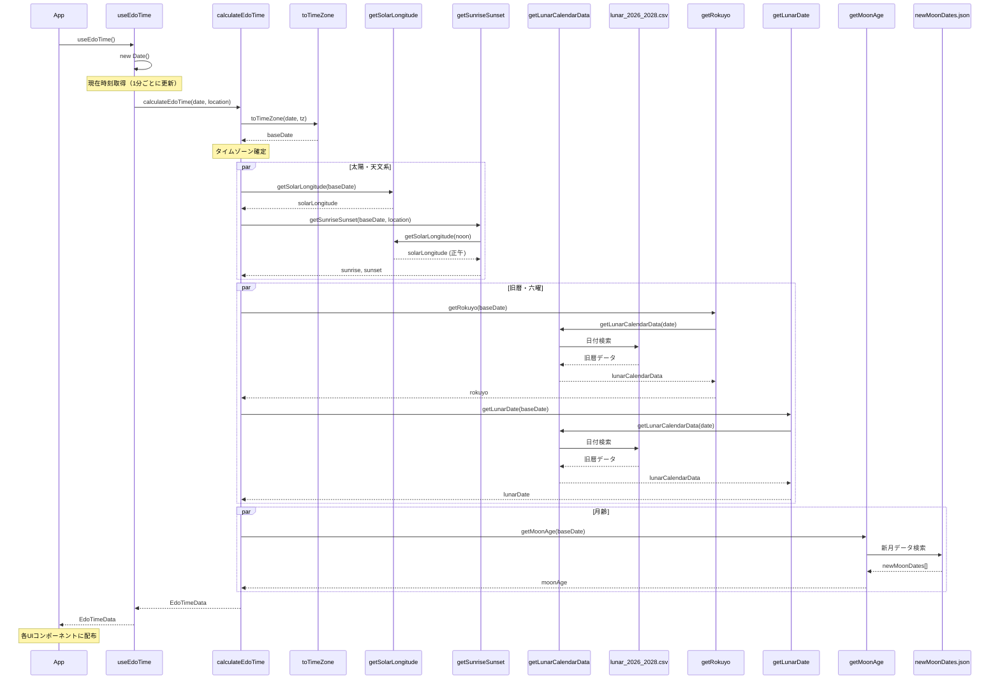

# データ取得フロー概要（江戸ごよみアプリ）

本アプリでは、現在時刻を起点として
**太陽・月・旧暦・六曜**に関する複数のデータを算出します。

それらの処理関係を以下のシーケンス図で示します。

---

## データ取得シーケンス図（整理版）

---

## 処理の流れ（人間向け説明）

### 1. 現在時刻の取得

* `useEdoTime` フックで `new Date()` により現在時刻を取得
* 1分ごとに再計算される

---

### 2. タイムゾーン変換

* `toTimeZone()` により、
  指定されたタイムゾーン（例: Asia/Tokyo）に変換
* 以降の計算は **すべて baseDate を基準**に行う

---

### 3. 太陽黄経の計算

* `getSolarLongitude(baseDate)`
* J2000.0 基準の近似式により算出
* 0〜360°に正規化

**用途**

* 二十四節気
* 七十二候
* 日の出・日の入り計算の前提

---

### 4. 日の出・日の入り時刻

* `getSunriseSunset(baseDate, location)`
* 内部処理：

  * 正午の太陽黄経を計算
  * 太陽赤緯を算出
  * 太陽高度が 0° となる時角を計算
* 結果：

  * `sunrise`
  * `sunset`

---

### 5. 六曜・旧暦月日の取得

* `getLunarCalendarData(baseDate)`
* CSV（`lunar_2026_2028.csv`）から該当日を検索
* 同一データから以下を取得：

  * 六曜
  * 旧暦 年・月・日（閏月含む）

※ 六曜と旧暦月日は **完全に同じデータソース**を使用

---

### 6. 月齢の計算

* `getMoonAge(baseDate)`
* `newMoonDates.json` に格納された新月時刻一覧を使用
* 最も近い「過去の新月」を検索
* 経過日数を月齢として算出（約 0〜29.5）

---

## 並列処理について（設計上）

* 以下の処理は **論理的に独立**している：

  * 太陽黄経
  * 日の出・日の入り
  * 六曜・旧暦
  * 月齢
* 設計上は並列実行可能
* 現在の実装では可読性・単純性を優先し逐次実行

---

## 使用しているデータソース

| 項目       | データ元                                  |
| -------- | ------------------------------------- |
| 現在時刻     | JavaScript `Date`                     |
| 太陽黄経     | 天文計算（近似式）                             |
| 日の出・日の入り | 天文計算                                  |
| 六曜・旧暦    | `lunar_2026_2028.csv`（koyomi8.com 参照） |
| 月齢       | `newMoonDates.json`（新月時刻）             |

---
